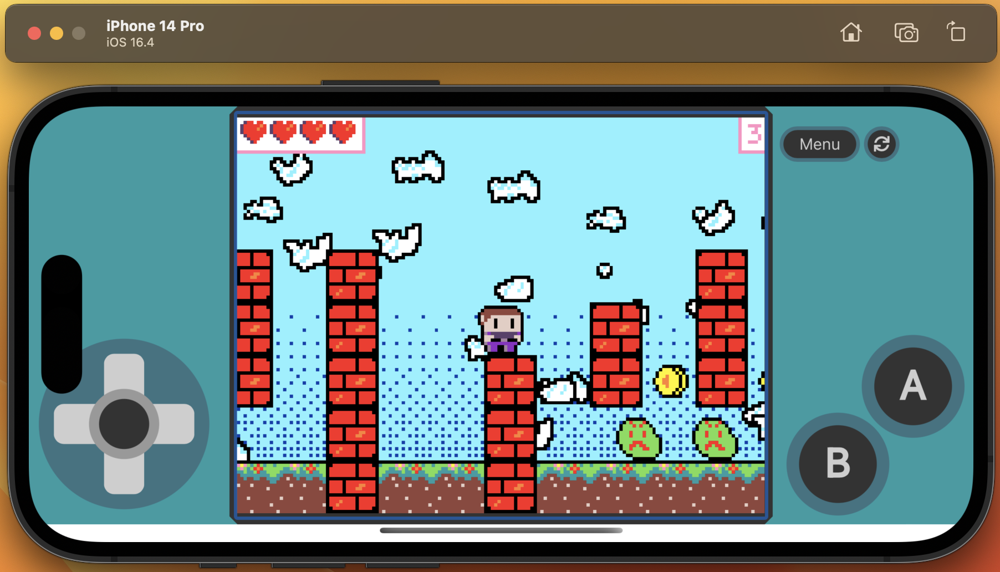

# MakeCode Arcade player for iOS

This is a simple demo illustrating how to package a [MakeCode Arcade](https://arcade.makecode.com) game into a native app for iOS.

## First-time dev setup

### Prerequisites

* For the iOS parts, you will need a **Mac** and **Xcode**.
* Install **git** on your platform.
* Install **NodeJS** v16 or later.

## Repo setup

Clone this repo and install dependencies.

1. `git clone https://github.com/humanapp/arcade-ios`
2. `cd arcade-ios`
3. `npm install`

## Basic development

### Open the project

1. Open this folder in [Visual Studio Code](https://code.visualstudio.com/) or your favorite editor.
    
    This is where you will edit the application code.

2. Open the project in Xcode: `npx cap open ios`. Requires a Mac.
    
    Xcode is where you will test in the iOS simulator and build for an actual device.

### Start dev server

On a command prompt: `npm start`. This will start the CRA dev server. This enables your changes to hot-reload in the iOS simulator (or in a browser, if that's where you're testing your app).

### Start the iOS simulator

In the instance of Xcode opened above, press the "start" button to run the app. The iOS simulator should startup and load a MakeCode Arcade game.

### Point the code to your shared game

1. In `src/App.tsx`, change `GAME_ID` to your game's Game ID.

    To get a Game ID, share a game from the MakeCode Arcade editor, then grab the identifier off the end of the generated URL, e.g.: https://arcade.makecode.com/**S27624-55361-60357-84470**

2. Save the file and see your game load in the iOS simulator!

### Just for fun

With the dev server running, you can also run your app in a browser at `http://localhost:3000`

### Debugging

Debugging is best done using the browser dev tools.

1. With the dev server running, navigate to `http://localhost:3000`. Your app should load in the browser.
2. Press F12 to open dev tools.
3. Open the Sources tab.
4. In the file explorer you should be able to find your source files in TypeScript form. Avoid any compiled JS. You can set breakpoints, single-step, inspect things, etc here.

## ~ Fin ~
Enjoy! This project only gets as far as loading in the iOS simulator. There are a few more steps necessary to upload it to the App Store.

This project was bootstrapped with **[Create React App (CRA)](https://github.com/facebook/create-react-app)**, and packaged for iOS using **[Capacitor JS](https://capacitorjs.com/)**. There are lots of great tutorials on YouTube for learning these frameworks.
